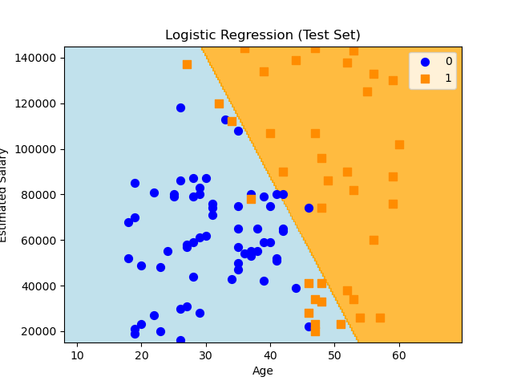
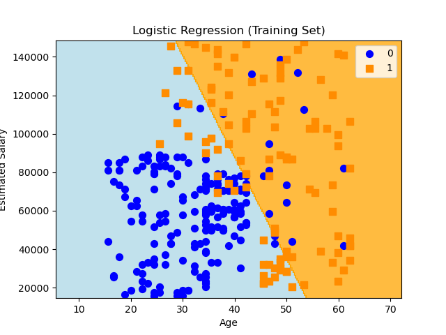

# 🚀 Logistic Regression Analysis Project

## 🌟 Overview

This project explores how logistic regression can be used to solve classification problems. By preparing data, building a model, and evaluating its performance, it demonstrates a practical approach to making predictions with real-world data.

---

## 📊 Dataset

The dataset used in this project consists of three columns:

| **Column**          | **Description**                                      |
|----------------------|------------------------------------------------------|
| `Age`               | The age of the individual.                           |
| `EstimatedSalary`   | The individual's estimated annual salary.            |
| `Purchased`         | Binary target variable (1 for purchase, 0 for no purchase). |

### Example Rows from the Dataset:

| **Age** | **EstimatedSalary** | **Purchased** |
|---------|----------------------|---------------|
| 19      | 19000               | 0             |
| 35      | 20000               | 0             |
| 26      | 43000               | 0             |
| 27      | 57000               | 0             |
| 19      | 76000               | 0             |
| 27      | 58000               | 0             |
| 27      | 84000               | 0             |
| 32      | 150000              | 1             |

This dataset provides the foundation for applying logistic regression to predict purchase decisions based on age and estimated salary.

---

## 🛠️ Project Structure

Here's what you'll find in this repository:

- **`Logistic Regression.ipynb`**: The primary notebook containing all the code for data analysis, model training, and evaluation.
- **`Test.png`**: Visualization of the logistic regression boundary on the test dataset.
- **`Train.png`**: Visualization of the logistic regression boundary on the training dataset.
- Additional resources: Any other images, graphs, or supplementary files will be added here.

---

## 🔍 Steps Performed

1. **Data Loading**:
   - Imported and explored the dataset to understand its structure and statistics.
2. **Data Preprocessing**:
   - Scaled features for optimal performance.
3. **Exploratory Data Analysis (EDA)**:
   - Created visualizations to uncover patterns and insights within the dataset.
4. **Model Training**:
   - Built and trained a logistic regression model using the `scikit-learn` library.
5. **Model Evaluation**:
   - Measured performance using accuracy and confusion matrices.

---

## 📈 Results

✨ **Key Outcomes**:
- **Accuracy**: *86%*
- **Precision & Recall**: Balanced and reliable model performance.
- **Insights**: Identified the most impactful features driving predictions.

---

## 📋 Requirements

Make sure your environment is set up with the following tools:

- **Python**: Version *3.12.X*
- **Jupyter Notebook**
- Libraries:
  - `numpy`
  - `pandas`
  - `matplotlib`
  - `scikit-learn`

---

## 📷 Visuals

Below are some visuals included in the project:

### Test Set

### Training Set

---

## 🤝 Contributing

Want to improve this project? Feel free to fork, clone, or submit a pull request! Collaboration is always welcome.

---

## 📬 Contact

Have questions or suggestions? Reach out to:
- **Name**: Mehmet Barış Güdül
- **Email**: mehmetbarisgudul@gmail.com
- **GitHub**: [barisgudul](https://github.com/barisgudul)

---

Feel free to personalize the file further and replace the placeholders with actual data, images, or links. Let me know if you'd like help with refining specific sections! 😊
